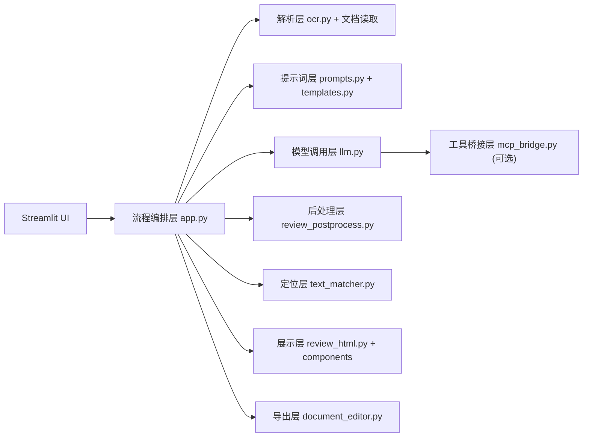

# 智审法务 Tech Spec（工程设计说明）

## 1. 目标与范围
本文档描述合同审查平台的工程实现方案，覆盖架构、模块、数据契约、关键流程、异常策略和测试要求，目标是保证系统可实现、可维护、可扩展。

范围包括：
- 合同解析（Docx/PDF/OCR）
- AI 审查与工具调用
- 风险工作台交互
- 条款应用与导出
- 本地配置与运行机制

## 2. 运行环境与依赖
- 运行环境：Windows，Python 3.11+
- 主要依赖：
  - `streamlit`
  - `openai`
  - `python-docx`
  - `PyPDF2`
  - `paddleocr==3.3.2`
  - `paddlepaddle>=3.2.0,<3.4.0`
  - `mcp`, `httpx`
- 可选依赖：
  - `pywin32`（Windows 上 MCP 相关依赖）

## 3. 总体架构



设计原则：
- 单体编排 + 模块分层，减少跨文件耦合。
- 关键逻辑可单独替换（OCR、LLM、MCP、导出）。
- UI 层不直接写复杂算法，算法收敛在 `legal_review/*`。

## 4. 模块设计

### 4.1 `app.py`
职责：
- 页面布局、交互事件、状态管理、流程编排。
- 串联解析、审查、后处理、渲染、导出。

关键状态：
- `review_snapshot`：当前审查结果快照。
- `applied_risks`：已应用的风险索引集合。
- `focus_risk_idx`：当前追问对象。
- `chat_messages`、`risk_followup_chats`：对话上下文。

### 4.2 `ocr.py`
职责：
- OCR 模型就绪检查。
- OCR 初始化预热。
- 文件 OCR 提取。
- PDF 是否需要 OCR 的启发式判断。

判断逻辑：
- 文本密度低、可读字符不足或有效页过少时，切换 OCR。
- OCR 不可用时返回明确提示信息。

### 4.3 `prompts.py`
职责：
- 管理审查系统提示词。
- 根据深度、立场、模板拼装动态 prompt。
- 定义 JSON 输出契约约束。

### 4.4 `templates.py`
职责：
- 维护内置模板和用户模板。
- 处理模板合并、覆盖、回退默认。
- 提供模板格式化标签供 UI 使用。

### 4.5 `llm.py`
职责：
- 执行 chat completion。
- 支持多轮工具调用循环（tool loop）。

核心行为：
- 若模型返回 `tool_calls`，执行工具并注回上下文。
- 达到工具轮次上限时停止并返回保护性提示。

### 4.6 `mcp_bridge.py`
职责：
- 读取 MCP 配置。
- 列出并封装 MCP 工具为 OpenAI tools schema。
- 根据路由执行具体工具调用。

约束：
- 当前采用“按调用启动子进程”的连接方式，优先保证通用性。

### 4.7 `review_postprocess.py`
职责：
- 审查结果清洗与规范化。
- 判断建议是否可直接应用。
- 识别说明性建议并做降级处理。

### 4.8 `text_matcher.py`
职责：
- 在合同全文中定位风险原文片段。
- 为高亮和替换提供稳定的文本坐标。

策略：
- 忽略空白匹配 -> 忽略标点匹配 -> 头尾包抄 -> 段落兜底。

### 4.9 `document_editor.py`
职责：
- 将已应用建议写回文档。
- 生成导出文件（Word/TXT）。

策略：
- 原始 docx 优先走段落定位替换，尽量保留格式。
- 非 docx 使用纯文本替换并导出备选格式。

## 5. 前端组件设计

### 5.1 风险卡片组件 `components/risk_deck`
- 输入：卡片 HTML 字符串。
- 输出事件：
  - `action=focus`：选择追问对象。
  - `action=apply`：切换应用状态。

### 5.2 拖拽投放组件 `components/dropzone`
- 支持大投放区和 mini 替换条两种模式。
- 输出：拖入风险索引与时间戳。

## 6. 数据契约

### 6.1 审查结果契约
```json
{
  "contract_type": "string",
  "overview": {
    "parties": ["string"],
    "amount": "string",
    "duration": "string",
    "sign_date": "string",
    "governing_law": "string",
    "summary": "string"
  },
  "risks": [
    {
      "level": "高风险|中风险|低风险",
      "dimension": "法律合规|风险防控|条款完善|利益保护",
      "original": "string",
      "issue": "string",
      "suggestion": "string",
      "legal_basis": "string"
    }
  ]
}
```

### 6.2 内部扩展字段
- `suggestion_display`：界面展示文本。
- `suggestion_actionable`：是否允许直接应用。
- `suggestion_warning`：说明性提示。

## 7. 核心流程设计

### 7.1 审查流程
1. 接收输入并提取合同文本。
2. 根据 UI 参数构建审查 prompt。
3. 调用模型，必要时进入工具循环。
4. 解析 JSON 结果并后处理。
5. 写入 `review_snapshot`，刷新工作台。

### 7.2 建议应用流程
1. 用户在卡片区点击应用或一键应用。
2. 系统仅处理 `suggestion_actionable=true` 的风险。
3. 在正文区标记已修订状态。
4. 导出时仅使用已应用集合生成最终文档。

### 7.3 追问流程
1. 用户选择风险点作为追问对象。
2. 生成风险专属系统上下文。
3. 发起追问并持久化会话历史。
4. 支持更换追问对象与清空历史。

## 8. 错误处理与降级
- 文件解析失败：返回可读错误并保留原输入状态。
- OCR 未初始化：显示初始化命令与缺失模型信息。
- API 配置缺失：在触发审查前阻断并提示必填项。
- LLM 非 JSON 返回：捕获解析异常并反馈到 UI。
- 建议不可应用：禁用应用按钮并提示原因。
- MCP 依赖异常：回退为无工具模式，保证主流程可用。

## 9. 性能策略
- 文本型 PDF 优先不走 OCR，降低耗时。
- OCR 引擎缓存，避免重复加载。
- MCP 工具列表做资源缓存。
- 快速模式降低工具轮次与模型开销。

## 10. 安全与隐私
- 默认本地配置存储，不引入云数据库。
- 支持本地模型接入，减少敏感文本外发。
- 明确输出用途为审查辅助，避免误用为正式法律意见。

## 11. 测试策略

### 11.1 功能测试
- 上传解析：docx/pdf/image/text。
- 审查输出：结构合法性、字段完整性。
- 交互链路：筛选、定位、应用、撤销、追问。
- 导出链路：HTML、docx、txt 可用性。

### 11.2 回归测试
- 不同合同类型样本回归。
- OCR 样本（清晰、倾斜、低对比度）回归。
- 不同模型配置回归（云端与本地）。

### 11.3 质量阈值
- 主流程必须端到端可运行。
- 审查结果 JSON 解析稳定。
- 错误提示必须可定位问题并可恢复。

## 12. 可扩展点
- 长合同分片审查与汇总。
- 风险结果版本比对。
- 审查审计日志。
- 多角色协作与审批。
- 行业知识库与模板插件化。
